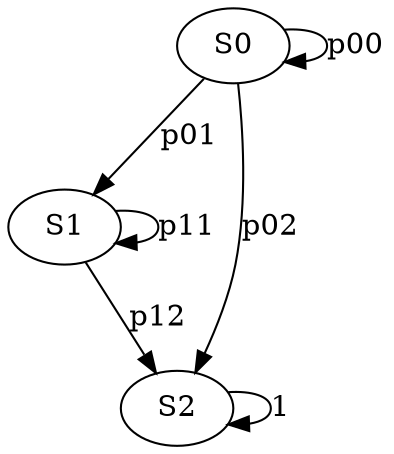

Продолжение про системы массового обслуживания. Окончили в прошлый раз о соответствии имитационных моделей СМО и аналитических моделей СМО. (будет работа о сравнении имитационных моделей СМО и аналитических СМО, но не домашка)
# Аналитические модели СМО
Можно получить только при довольно общих допущений - более строгих допущений. Почему сразу с них? Не любая имитационная МСМО может быть описана аналитической МСМО.
К типичным допущениям относится следущее:
- СМО без приоритетной дисциплины, все заявки равны. Обслуживание типа FIFO(очередь)
- Времена обслуживания заявок выбираются в соответствии с показательным законом распределения $F(x) = 1-e^{-\lambda x} \implies f(x) = \lambda e^{-\lambda x}$. В этом случае поток заявок называется пуассоновским, так как для этого потока вероятность появления k заявок за интервал $\Delta t$  определяется законом Пуассона
-  кроме того, поток заявок обладает свойствами стационарности, ординарным (невозможность появление двух заявок на входе СМО одновременно), отсутствием последействия (если есть поток, то число пришедших заявок в один момент времени не влияет на число заявок в другой момент времени. *Если любых двух непересекающихся участков времени число попадающих событий не зависит от сколько событий попало на другой, говорим о входном потоке без последействия*)
- В большинстве случаев МСМО описывают систему с конечным числом состояний и с отсутствием последействия.

Можно вспомнить марковские процессы и цепи, которые также возможно использовать как аналитическую МСМО. 

Дискретной марковской цепью называют случайный марковский процесс, в котором смена дискретного состояния происходит в определенные моменты времени при этом состояния системы будет зависеть от текущего состояния, но не зависит от предыдущих состояний. Смена дискретных состояний происходит в случайный момент времени. Таким образом марковские цепи характеризуются множеством состояний, 

Будем рассматривать задачу из книги Елены Винцель. К ней обратились с просьбой. На стрельбах фиксированное число курсантов, фиксированное число мишеней. нужно было понять сколько нужно взять патронов, и понять за сколько выстрелов в среднем поражается мишень. Таким образом, Дано:
- $S_0$ - мишень не повреждена, $S_1$ - частично повреждена, $S_2$ - разрушена
- Из предыдущих стрельб были известны вероятности попадания, то есть матрица вероятностей переходов для каждого состояния мишени и каждого курсанта
$$\begin{pmatrix}
S_{00} & S_{01} & S_{02} \\
0 & S_{11} & S_{12} \\
0 & 0 & 1
\end{pmatrix}$$



Как выглядит эксперимент при графовой модели? Выберем конкретные значения
$$\begin{pmatrix}
0.2 & 0.7 & 0.1 \\
0 & 0.2 & 0.8 \\
0 & 0 & 1
\end{pmatrix}$$
Отмечаем вероятности на осях. На каждой из них равномерно-распределенную случайную величину генерируем, и сравниваем в какой диапазон попадает - на то и меняем состояние агента. Например, было S0, сгенерировали 0.5, значит меняем состояние на S1.
```
S0 -0----0.2---------------0.9---1-->
S1 -0----0.2---------------------1-->
S2 -0----------------------------1-->
```
В результате вычислиетльных экспериментов получаем последвоательности состояний
```
S0 -> S0 -> S1 -> S2
S0 -> S0 -> S0 -> S1 -> S1 -> S2
S0 -> S1 -> S1 -> s1 -> s2
s0 -> s0 -> s0 -> s0 -> s1 -> s1 -> s1 -> s1 -> s2
s0 -> s0 -> s1 -> s1 -> s2
```
Строим график зависимости среднего от числа экспериментов и наблюдаем по ЗБЧ приближение к матожиданию. По полученному матожиданию получаем наиболее вероятные затраты на стрельбы. Стоит еще брать запас на дисперсию.

Где формальное описание? пока его нет. Графовая модель является моделью, но имитационная, пока не аналитическая.

Марковские цепи характеризуются множеством состосний S, матрицой перехода P и начального состояния S0. Удобно представлять в виде графа с вероятностями перехода-дугами.

Интенсивность перехода
$$v_{ij} = \lim_{t_k \to 0} \frac{p_{ij}}{t_k}$$
$ij$ - состояния, k - момент времени. $v_{ij}$ - интенсивность перехода из состояния i в состояние j за время $t_k$. Если переходные вероятности не зависят от времени, то марковская цепь называется однородной, в противном - неоднородная. Если $N = |S|$, то $\sum_{ij} v_{ij} =0$ (ПОЧЕМУ ТАК?)

$$\sum_{i\ne j} v_{ij} + \sum_{i=j} v_{ii} = 0 \implies \sum_{i\ne j} v_{ij} =- \sum_{i=j} v_{ii} \tag{*}$$
Поэтому на марковские процессы накладывается еще условие $(*)$ 

Большинство выходных паарметров СМО можно определить используя информацию о состояниях СМО в установившихся режимах и в будущих режимах. Такая информация имеет вероятностную природу - можно описать вероятностный переход из состояния в состояние используя приращение времени и вероятностей перейти к описанию перехода как дифференциальное уравнение - **уравнение Колмогорова**.

$p_{ij}$ вероятность перехода из j в i
$$\Delta p_i(t_1) = p_i(t + t_1) - p_i(t) = \sum p_{ji}(t_1) p_j(t) - \sum p_{ik}(t_1)p_{i}(t)$$
Оба уравнение делятся на $t_1$ и переход к пределу и получают систему диффуров - уравнение Колмогорова.
$$\frac{dP_i}{dt} = \sum_j(V_{ji}P_j) - P_i \sum_k V_{ik}$$
В стационарном состояние система сводится к САУ


концептуальное описание -определенеие для решения задачи, доопределение остосния. Кто кем является в задаче. Концептуальное описание - схема 